# 📚 Audiobook & Videobook Implementation Plan
## Browser-Native PDF Viewer with Client-Side TTS & Highlighting

### 🎯 **Project Goals**
- **Books**: Native browser PDF viewing experience
- **Audiobooks**: Client-side TTS with high-quality voices
- **Videobooks**: Real-time word highlighting synchronized with audio
- **Platform**: Astro static site on GitHub Pages (no server costs)
- **Compatibility**: All mobile and desktop browsers

---

## 🏗️ **Architecture Overview**

```mermaid
graph TD
    A[PDF URL] --> B[Browser Native PDF Viewer]
    B --> C[PDF Text Extraction API]
    C --> D[Text Processing]
    D --> E{Mode Selection}
    E --> F[📖 Read Mode]
    E --> G[🔊 Audio Mode]
    E --> H[🎬 Video Mode]
    G --> I[Client-Side TTS]
    H --> J[TTS + Word Highlighting]
    I --> K[Audio Output]
    J --> L[Synchronized Visual + Audio]
```



---

## 🔧 **Technical Implementation Strategy**

### **1. Browser-Native PDF Integration**
```html
<!-- Replace complex PDF.js with simple browser viewer -->
<iframe 
  src="data:application/pdf;base64,${pdfBase64}" 
  class="pdf-native-viewer"
  title="PDF Document">
</iframe>

<!-- Alternative: Direct PDF URL -->
<embed 
  src="${pdfUrl}" 
  type="application/pdf" 
  class="pdf-native-viewer">
```

**Benefits:**
- ✅ Zero JavaScript complexity
- ✅ Native zoom, scroll, search
- ✅ Mobile-optimized by browser
- ✅ Accessibility built-in
- ✅ No loading/rendering overhead

### **2. Client-Side Text Extraction**
```javascript
// Use PDF.js worker ONLY for text extraction (not rendering)
class PdfTextExtractor {
  async extractText(pdfUrl) {
    const pdf = await pdfjsLib.getDocument(pdfUrl).promise;
    const textData = [];
    
    for (let i = 1; i <= pdf.numPages; i++) {
      const page = await pdf.getPage(i);
      const textContent = await page.getTextContent();
      const pageText = this.processTextItems(textContent.items);
      textData.push(pageText);
    }
    
    return textData;
  }
  
  processTextItems(items) {
    return items.map(item => ({
      text: item.str,
      x: item.transform[4],
      y: item.transform[5],
      width: item.width,
      height: item.height
    }));
  }
}
```

### **3. Enhanced Client-Side TTS System**
```javascript
class UniversalTTSManager {
  constructor() {
    this.fallbackChain = [
      'browserNative',
      'webSpeechAPI', 
      'speechSynthesis'
    ];
  }
  
  async getBestVoice() {
    const voices = speechSynthesis.getVoices();
    
    // Platform-specific quality ranking
    const qualityRanking = {
      // macOS high-quality voices
      'Alex': 100, 'Samantha': 95, 'Victoria': 90,
      // Windows quality voices  
      'Zira': 85, 'David': 80, 'Mark': 75,
      // Android Google voices
      'Google US English': 90, 'Google UK English': 85,
      // Fallback voices
      'Microsoft': 60, 'eSpeak': 30
    };
    
    return voices
      .map(voice => ({
        voice,
        score: this.calculateVoiceScore(voice, qualityRanking)
      }))
      .sort((a, b) => b.score - a.score)[0]?.voice;
  }
  
  async speakWithWordCallback(text, onWordStart) {
    const utterance = new SpeechSynthesisUtterance(text);
    const words = text.split(' ');
    let wordIndex = 0;
    
    // Estimate word timing (since browser TTS doesn't provide word events)
    const estimatedDuration = text.length * 60; // ms per character
    const wordInterval = estimatedDuration / words.length;
    
    utterance.onstart = () => {
      const wordTimer = setInterval(() => {
        if (wordIndex < words.length) {
          onWordStart(words[wordIndex], wordIndex);
          wordIndex++;
        } else {
          clearInterval(wordTimer);
        }
      }, wordInterval);
    };
    
    speechSynthesis.speak(utterance);
  }
}
```

### **4. Word Highlighting Overlay System**
```javascript
class WordHighlighter {
  constructor(pdfContainer) {
    this.container = pdfContainer;
    this.overlay = this.createOverlay();
  }
  
  createOverlay() {
    const overlay = document.createElement('div');
    overlay.className = 'word-highlight-overlay';
    overlay.style.cssText = `
      position: absolute;
      top: 0; left: 0;
      width: 100%; height: 100%;
      pointer-events: none;
      z-index: 10;
    `;
    this.container.appendChild(overlay);
    return overlay;
  }
  
  highlightWord(wordData, pageNumber) {
    const highlight = document.createElement('div');
    highlight.className = 'word-highlight';
    highlight.style.cssText = `
      position: absolute;
      left: ${wordData.x}px;
      top: ${wordData.y}px;
      width: ${wordData.width}px;
      height: ${wordData.height}px;
      background: rgba(255, 255, 0, 0.4);
      border-radius: 2px;
      animation: highlightPulse 0.3s ease-in-out;
    `;
    
    this.overlay.appendChild(highlight);
    
    // Remove after animation
    setTimeout(() => highlight.remove(), 500);
  }
}
```

---

## 📱 **Mobile & Desktop Optimization**

### **Responsive Design**
```css
.pdf-viewer-container {
  display: flex;
  flex-direction: column;
  height: 100vh;
}

.pdf-native-viewer {
  flex: 1;
  width: 100%;
  border: none;
}

/* Mobile optimizations */
@media (max-width: 768px) {
  .audio-controls {
    position: fixed;
    bottom: 0;
    left: 0;
    right: 0;
    background: rgba(0,0,0,0.9);
    padding: 1rem;
  }
  
  .word-highlight {
    /* Larger touch targets on mobile */
    min-width: 44px;
    min-height: 44px;
  }
}
```

### **Touch Interactions**
```javascript
class TouchOptimizer {
  constructor() {
    this.setupTouchGestures();
  }
  
  setupTouchGestures() {
    // Double-tap to play/pause
    let lastTap = 0;
    document.addEventListener('touchend', (e) => {
      const currentTime = new Date().getTime();
      const tapLength = currentTime - lastTap;
      if (tapLength < 500 && tapLength > 0) {
        this.togglePlayback();
      }
      lastTap = currentTime;
    });
    
    // Swipe gestures for page navigation
    this.setupSwipeNavigation();
  }
}
```

---

## 🎵 **Audio Mode Implementation**

### **Features:**
- ✅ High-quality voice selection
- ✅ Speed control (0.5x - 2x)
- ✅ Auto-page advancement
- ✅ Background playback
- ✅ Progress saving

```javascript
class AudiobookMode {
  constructor(pdfTextData) {
    this.textData = pdfTextData;
    this.currentPage = 1;
    this.isPlaying = false;
    this.settings = {
      speed: 1.0,
      autoAdvance: true,
      voice: null
    };
  }
  
  async startReading() {
    const pageText = this.textData[this.currentPage - 1];
    const fullText = pageText.map(item => item.text).join(' ');
    
    await this.ttsManager.speak(fullText, {
      rate: this.settings.speed,
      voice: this.settings.voice,
      onEnd: () => {
        if (this.settings.autoAdvance && this.currentPage < this.textData.length) {
          this.currentPage++;
          this.startReading();
        }
      }
    });
  }
}
```

---

## 🎬 **Video Mode Implementation**

### **Features:**
- ✅ Real-time word highlighting
- ✅ Synchronized audio-visual
- ✅ Reading speed adaptation
- ✅ Interactive word clicking

```javascript
class VideobookMode extends AudiobookMode {
  constructor(pdfTextData, highlighter) {
    super(pdfTextData);
    this.highlighter = highlighter;
  }
  
  async startReading() {
    const pageText = this.textData[this.currentPage - 1];
    const words = this.extractWords(pageText);
    
    await this.ttsManager.speakWithWordCallback(
      words.map(w => w.text).join(' '),
      (word, index) => {
        this.highlighter.highlightWord(words[index], this.currentPage);
      }
    );
  }
  
  extractWords(pageTextItems) {
    // Convert text items to word-level data with positions
    return pageTextItems.flatMap(item => 
      item.text.split(' ').map((word, i) => ({
        text: word,
        x: item.x + (i * item.width / item.text.split(' ').length),
        y: item.y,
        width: item.width / item.text.split(' ').length,
        height: item.height
      }))
    );
  }
}
```

---

## 🚀 **GitHub Pages Deployment**

### **Static Site Structure**
```
library/
├── public/
│   ├── pdfs/           # PDF files
│   └── pdf.worker.min.mjs
├── src/
│   ├── components/
│   │   ├── PdfViewer.astro
│   │   ├── AudioControls.astro
│   │   └── VideoControls.astro
│   ├── scripts/
│   │   ├── tts-manager.js
│   │   ├── word-highlighter.js
│   │   └── pdf-text-extractor.js
│   └── styles/
│       └── pdf-viewer.css
└── astro.config.mjs
```

### **Astro Component Integration**
```astro
---
// src/components/UniversalPdfViewer.astro
export interface Props {
  pdfUrl: string;
  mode?: 'read' | 'audio' | 'video';
}

const { pdfUrl, mode = 'read' } = Astro.props;
---

<div class="universal-pdf-viewer" data-mode={mode}>
  <div class="pdf-container">
    <embed src={pdfUrl} type="application/pdf" class="pdf-native-viewer" />
  </div>
  
  <div class="mode-controls">
    <button data-mode="read">📖 Read</button>
    <button data-mode="audio">🔊 Audio</button>
    <button data-mode="video">🎬 Video</button>
  </div>
  
  <div class="audio-controls" style="display: none;">
    <!-- Audio controls component -->
  </div>
</div>

<script>
  import { UniversalTTSManager } from '../scripts/tts-manager.js';
  import { WordHighlighter } from '../scripts/word-highlighter.js';
  import { PdfTextExtractor } from '../scripts/pdf-text-extractor.js';
  
  // Initialize based on mode
  const viewer = document.querySelector('.universal-pdf-viewer');
  const mode = viewer.dataset.mode;
  
  // Implementation here...
</script>
```

---

## 💰 **Cost Analysis: Client-Side vs API**

| Aspect | Client-Side (Our Approach) | External TTS APIs |
|--------|----------------------------|-------------------|
| **Cost** | $0 (GitHub Pages free) | $4-15 per 1M characters |
| **Privacy** | Complete client privacy | Data sent to servers |
| **Latency** | Instant (local processing) | Network dependent |
| **Voice Quality** | Platform dependent | Consistently high |
| **Offline** | Works offline | Requires internet |
| **Scalability** | Unlimited users | Pay per usage |

**Recommendation**: Start with client-side approach for zero cost and privacy, with option to add premium API voices later as paid feature.

---

## 📋 **Implementation Phases**

### **Phase 1: Browser PDF Integration (Week 1)**
- [ ] Replace PDF.js rendering with browser native viewer
- [ ] Implement responsive design for mobile/desktop
- [ ] Add basic mode switching (Read/Audio/Video)

### **Phase 2: Enhanced TTS System (Week 2)**
- [ ] Implement UniversalTTSManager with voice quality ranking
- [ ] Add audio controls (play/pause/speed/voice selection)
- [ ] Implement progress saving and auto-advance

### **Phase 3: Word Highlighting (Week 3)**
- [ ] PDF text extraction for word positioning
- [ ] Word-level highlighting overlay system
- [ ] Synchronization between TTS and highlighting

### **Phase 4: Mobile Optimization (Week 4)**
- [ ] Touch gesture support
- [ ] Mobile-specific UI adaptations
- [ ] Background playback capabilities
- [ ] Progressive Web App features

---

## 🎯 **Success Metrics**

- ✅ **Performance**: <2s load time on mobile
- ✅ **Compatibility**: Works on 95% of browsers
- ✅ **Voice Quality**: Rated 4+ stars by users
- ✅ **Highlighting Accuracy**: 95% word sync precision
- ✅ **Mobile Experience**: Touch-optimized interface
- ✅ **Zero Cost**: No server or API costs

---

This plan provides a complete roadmap for implementing books, audiobooks, and videobooks using browser-native PDF viewing with client-side TTS and highlighting, perfect for your GitHub Pages Astro static site with zero ongoing costs.